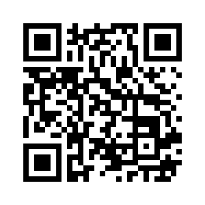
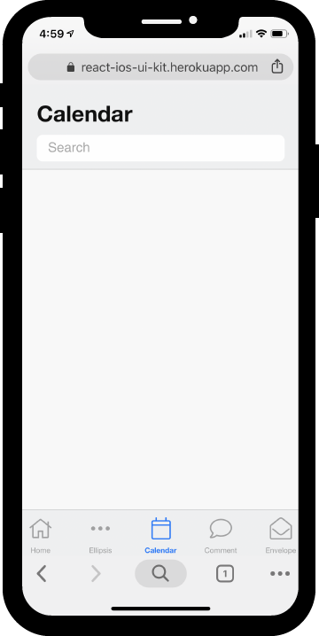

# ReactiOS

A react component library designed for mobile inspired by iOS.

## Quick Start

```yarn install```

```yarn start```

### Links

[Live Site](http://react-ios-ui-kit.herokuapp.com/)



### Screenshots



*iPhone XS iOS 12.0, Chrome*

### Components

#### Header

| Name         | Type    | Default | Description |
| ------------ | ------- | ------- | ----------- |
| title | string | `'Title'` | title to appear on the page |
| color | string | `#111111` | title font color |
| hr | boolean | `true` | header has bottom border |
| secondadry | boolean | `false` | alternate style |
| search | boolean | `false` | include a search bar |

#### Footer

| Name         | Type    | Default | Description |
| ------------ | ------- | ------- | ----------- |
| linkColor | string | `theme.color.darkGrey` | link color |
| activeColor | string | `theme.color.blue` | active link color |
| labels | boolean | `true` | display labels under icons |
| borderColor | string | `theme.color.grey` | top border color |
| backgroundColor | string | `theme.color.lightGrey` | background color |

#### Search

| Name         | Type    | Default | Description |
| ------------ | ------- | ------- | ----------- |
| icon | boolean | `true` | display search bar icon |
| iconColor | string | `theme.color.darkGrey` | magnifying glass icon color |
| cursorColor | string | `theme.color.blue` | sets the color of the text insertion caret |

